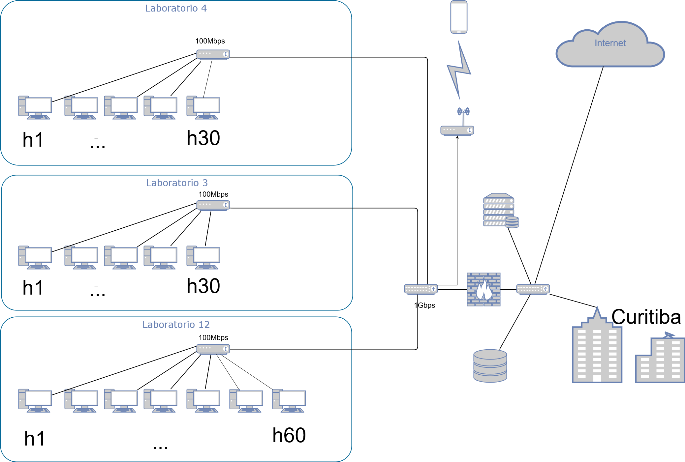

# Trabalho Redes I

Trabalho de Redes I da UFPR representando a topologia interna dos laboratórios do Departamento de Informática.

## Instruções

1. Navergar até o diretório onde redes.py está.
2. Executar: sudo python redes.py

## Topologia



## Testes

O primeiro experimento executado demonstrou que a perda de pacotes entre os terminais que se econtram conectados em um mesmo *Switch* e, em geral, a metade quando tenta se conectar com outro terminal que esta em conectado a um *Switch* diferente.

### Forwarding Error

Para simular o erro de redirecionamento foram realizados os seguintes comandos:
``` bash
    mininet> link s1 h1 down
    mininet> h1 ping h90
    connect: Network is unreachable
```
__Podemos concluir que:__ mesmo com a conexao estabelecida, quando as se remove o link de uma das maquinas com o *Switch* a conexao fica inalcansavel.

### Congestion
Para testes de congestionamento, foram executados os seguintes comandos: 

``` bash
    mininet> iperf
    mininet> h1 ping h82 &
    mininet> h2 ping h111 &
    mininet> h50 ping h3 &
    mininet> h1 ping h2 &
    mininet> iperf
```

__Podemos concluir que:__ Quando executamos o iperf pela segunda vez, podemos constatar uma queda consideravel nos resultados obtidos da rede, quando em relacao a troca de mensagens.

### Available Bandwidth

Com os testes anteriores, podemos notar que os switches criam um gargalo em relacao a largura de banda utilizada, visto que o acesso a outros hosts que estao conectados a switches diferentes a disponibilidade da largura de banda e alterada.